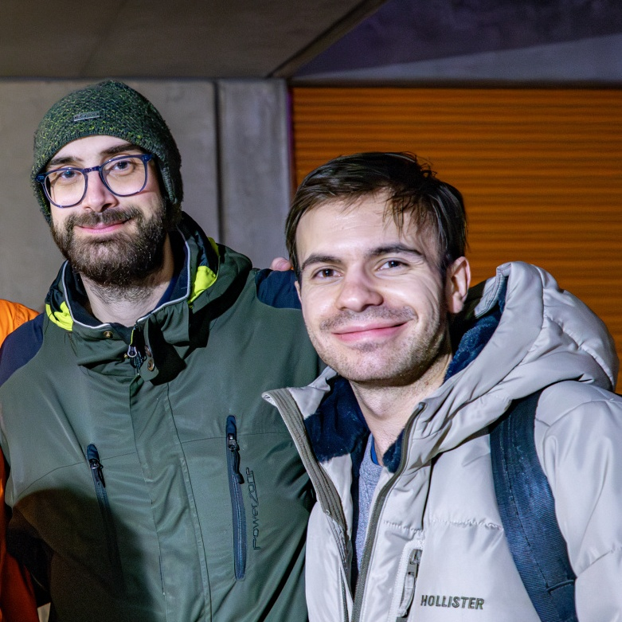

<!--
theme: gaia
size: 16:9
paginate: true
author: B. Chapuis, O. Lemer, O. Tischauser, V. Guidoux, with the help of ChatGPT.
url: https://web-classroom.github.io/
footer: '**HEIG-VD** - WEB Course 2023-2024 - AGPL-3.0 license'
style: |
    :root {
        --color-background: #fff;
        --color-foreground: #333;
        --color-highlight: #f96;
        --color-dimmed: #888;
        --color-headings: #7d8ca3;
    }
    blockquote {
        font-style: italic;
    }
    table {
        width: 100%;
    }
    th:first-child {
        width: 15%;
    }
    h1, h2, h3, h4, h5, h6 {
        color: var(--color-headings);
    }
    h2, h3, h4, h5, h6 {
        font-size: 1.5rem;
    }
    h1 a:link, h2 a:link, h3 a:link, h4 a:link, h5 a:link, h6 a:link {
        text-decoration: none;
    }
    section:not([class=lead]) > p, blockquote {
        text-align: justify;
    }
    ul {
        margin-top: 0.5rem;
    }
    section::after {
      content: attr(data-marpit-pagination-) '/' attr(data-marpit-pagination-total);
    }
-->

[web]:
  https://web-classroom.github.io/heig-vd-web-course/01-introduction-and-course-organization/
[pdf]:
  https://web-classroom.github.io/heig-vd-web-course/01-introduction-and-course-organization/01-introduction-and-course-organization-presentation.pdf
[license]:
  https://github.com/web-classroom/heig-vd-web-course/blob/main/LICENSE.md
[illustration]:
  https://images.unsplash.com/photo-1659328376647-52ec39d1a5cf?fit=crop&h=720
[questions]:
  https://images.unsplash.com/photo-1548445929-4f60a497f851?fit=crop&h=720
[source]:
  https://github.com/web-classroom/heig-vd-web-course/blob/main/01-introduction-and-course-organization/PRESENTATION.md
[apod]: https://apod.nasa.gov/apod/image/2312/ArcticNight_Cobianchi_1080.jpg

# Web Technologies

## Organization

<!--
_class: lead
_paginate: false
-->

<https://github.com/web-classroom/heig-vd-web-course>

[Web][web] · [PDF][pdf] · [Source][source]

<small>This work is licensed under the [CC BY-SA 4.0][license] license.</small>

![bg opacity:0.1][illustration]

---

## 🧑‍🏫 Staff

- Vincent Guidoux
  - Lecturer
  - He/Him
  - 🎭🚲🌿🖖🎶
- Hadrien Louis
  - Assistant
  - He/Him
  - 🀄🧗🏻‍♂️🎾🍫🧑‍💻

---

## 📋 Objectives

Master the fundamentals of the Web to enable the adoption of any framework in
the future. As a result, there's no point in obsessing over a particular
framework.

---

## 🔄 Prerequisites

- Object-oriented programming
- Network programming (sockets, TCP, UDP, HTTP)

![bg opacity:0.1][apod]

---

## 🛠️ Teaching tools

- Slides on
  [https://web-classroom.github.io/heig-vd-web-course/](https://web-classroom.github.io/heig-vd-web-course/)
  in Web or PDF version, with lecture notes.
  - Generally in English.
- [GitHub Classroom](https://classroom.github.com/classrooms/54867215-web-classroom-spring-24-vgx)
  for rendering and marking exercises.
- [GitHub Discussions](https://github.com/orgs/web-classroom/discussions) for
  interaction, questions and feedback. If you need anonymity, send me an email
  (`vincent.guidoux1@heig-vd.ch`).
- GAPS for assessment dates.

---

## 📅 Session format

Wednesday 09:15, 3 periods & Wednesday 14:55, 3 periods

- Correcting the lab and answering questions raised on Github Discussions
- Quick quiz (not marked)
- Theoretical course with some hands-on
- Lab
- Interruptions during the course are **welcome**!

---

## 🏅 Notation

- 6-8 labs, 4 of which build on the previous one to create an online multiplayer
  game. (20%)
- 2-3 evaluation, formats and dates to be defined (30%)
- Final exam (50%)

---

# ✋ Questions

![bg opacity:0.1][questions]

---

## Sources

- [A bunch of flowers from a string](https://unsplash.com/photos/a-bunch-of-flowers-from-a-string-lP_FoHCLjWk)
  by Griffin Quinn is licensed under
  [Unsplash License](https://unsplash.com/license)
- [Best team](https://clubphoto.heig-vd.ch/picture.php?/3349/category/91) by
  Miguel Santamaria ❤️
- [Aurora and Milky Way over Norway](https://apod.nasa.gov/apod/ap231212.html)
  by Giulio Cobianchi
- [Gray concrete tunnel under green trees](https://unsplash.com/photos/gray-concrete-tunnel-under-green-trees-omL9Q8B2YCI)
  by Anna Gru is licensed under [Unsplash License](https://unsplash.com/license)
